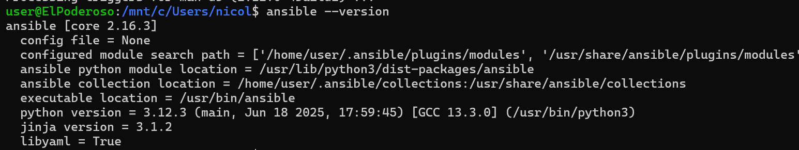
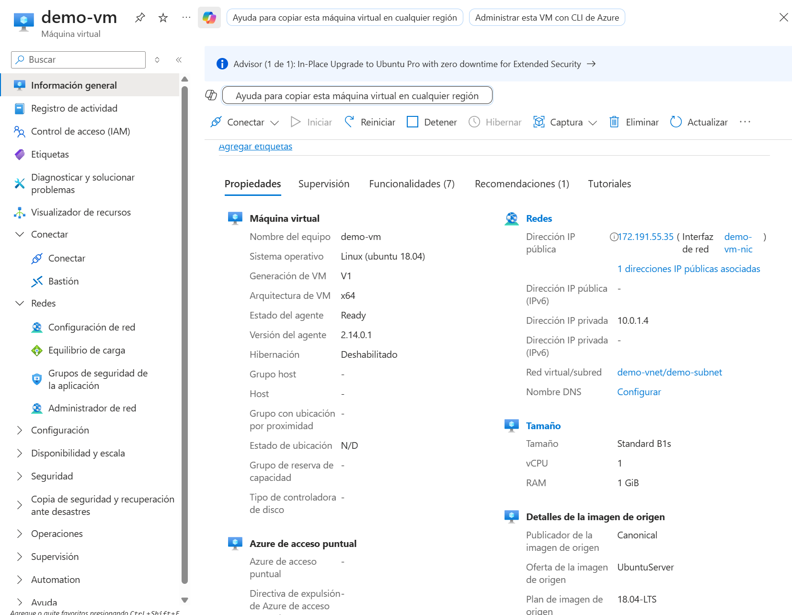
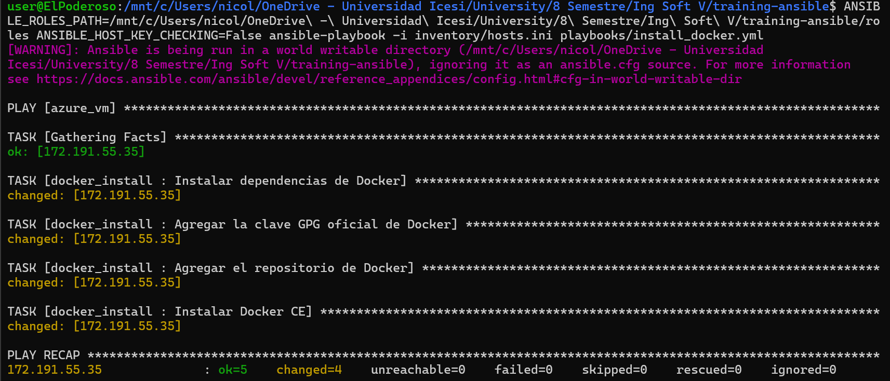
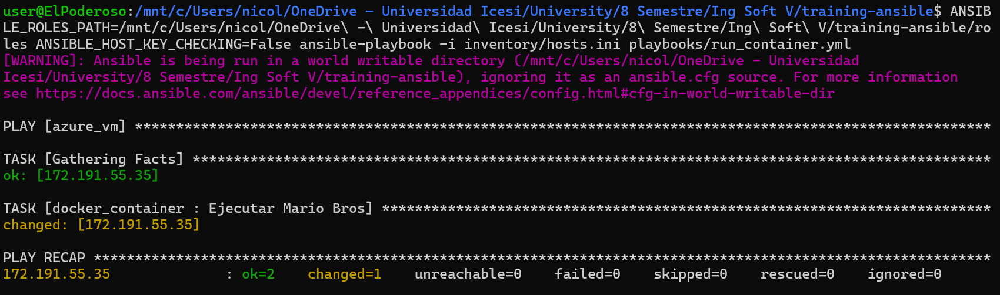
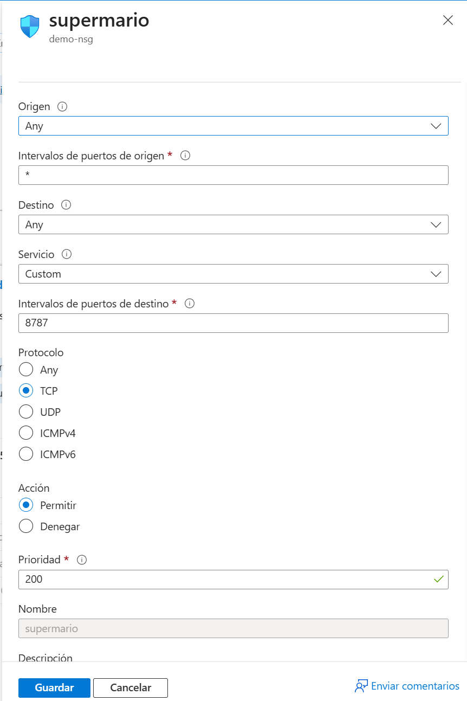
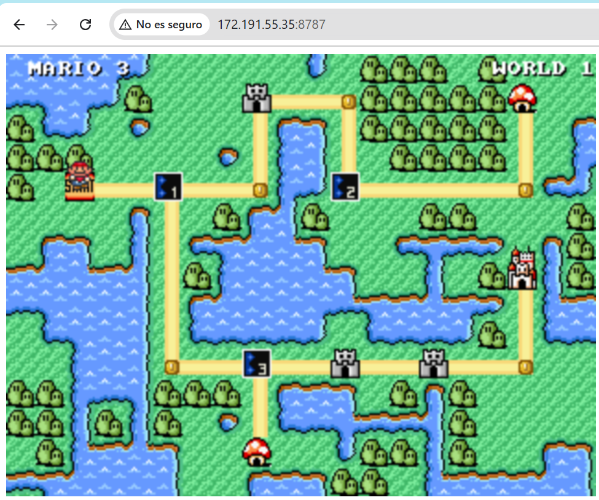

# Despliegue Automatizado de Super Mario Bros en Azure utilizando Ansible

## 📋 Descripción del Proyecto

Se implementó una solución de automatización utilizando Ansible para el despliegue de un contenedor Docker que ejecuta el juego Super Mario Bros en una máquina virtual de Azure. La implementación se realizó siguiendo las mejores prácticas de Infrastructure as Code (IaC).

## 🏗️ Arquitectura del Sistema

Se estructuró el proyecto siguiendo una arquitectura modular con la siguiente organización:

```bash
training-ansible/
├── ansible.cfg              # Configuración central de Ansible
├── inventory/
│   └── hosts.ini           # Especificación del inventario de servidores
├── playbooks/
│   ├── install_docker.yml  # Playbook de instalación de Docker
│   └── run_container.yml   # Playbook de despliegue del contenedor
└── roles/
    ├── docker_install/     # Rol de instalación de Docker
    │   └── tasks/
    │       └── main.yml
    └── docker_container/   # Rol de gestión del contenedor
        └── tasks/
            └── main.yml
```

## 📋 Requisitos del Sistema

Se requieren los siguientes componentes para la ejecución del proyecto:

- Sistema operativo Windows 10/11 con WSL2
- Cuenta activa en Microsoft Azure
- Máquina virtual Ubuntu en Azure
- Ansible y sshpass instalados en WSL

## 🚀 Proceso de Implementación

### 1. Preparación del Entorno WSL

Se realizó la instalación de las dependencias necesarias en el entorno WSL:



### 2. Configuración de la Máquina Virtual

Se estableció una máquina virtual en Azure con las siguientes especificaciones:

- Sistema Operativo: Ubuntu 20.04 LTS
- Tamaño: Standard B1s
- Configuración de acceso: Usuario azureuser



### 3. Instalación de Docker

Se ejecutó el playbook de instalación de Docker en la máquina virtual:



### 4. Despliegue del Contenedor

Se implementó el contenedor del juego utilizando el playbook correspondiente:



### 5. Configuración de Red

Se establecieron las reglas de seguridad de red necesarias en Azure:



### 6. Verificación del Despliegue

Se verificó el acceso al juego a través del navegador:



## 🔧 Configuración de Red

Se implementaron las siguientes reglas de seguridad en Azure:

- Puerto: 8787
- Protocolo: TCP
- Acceso: Público
- Prioridad: 200
- Nombre de la regla: supermario-8787

## 📈 Resultados y Logros

Se alcanzaron los siguientes objetivos:

- Se implementó una solución automatizada para el despliegue de aplicaciones containerizadas
- Se estableció una infraestructura como código utilizando Ansible
- Se configuró un entorno de juego accesible a través de la web
- Se implementaron prácticas de seguridad en la nube

## 🛠️ Herramientas Utilizadas

- Ansible para la automatización
- Docker para la containerización
- Microsoft Azure para la infraestructura cloud
- WSL2 para el entorno de desarrollo

## 📝 Conclusiones

La implementación demuestra la efectividad de las herramientas de automatización modernas para el despliegue de aplicaciones. Se logró crear un proceso reproducible y escalable que puede servir como base para futuros proyectos de automatización.
